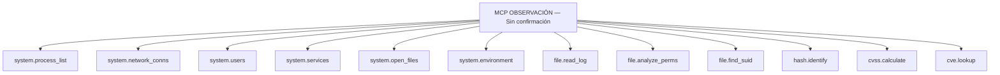

# ████████████████████████████████████████████████████████████
#
#   ███████╗██████╗ ███████╗ ██████╗████████╗███████╗██████╗
#   ██╔════╝██╔══██╗██╔════╝██╔════╝╚══██╔══╝██╔════╝██╔══██╗
#   ███████╗██████╔╝█████╗  ██║        ██║   █████╗  ██████╔╝
#   ╚════██║██╔═══╝ ██╔══╝  ██║        ██║   ██╔══╝  ██╔══██╗
#   ███████║██║     ███████╗╚██████╗   ██║   ███████╗██║  ██║
#   ╚══════╝╚═╝     ╚══════╝ ╚═════╝   ╚═╝   ╚══════╝╚═╝  ╚═╝
#
#   Security · Pentesting · Exploitation · Control · Terminal
#   ── Engine for Recon ──
#
#   Documento de Concepto y Arquitectura — v2.0
#   Clasificación: USO PROFESIONAL ÉTICO AUTORIZADO
#
████████████████████████████████████████████████████████████
Versión: v2.0 | Fecha: 2026-03-21

---

> **SPECTER** es un asistente de inteligencia artificial local, especializado en ciberseguridad ofensiva y defensiva, que ejecuta comandos reales en el sistema, interpreta sus resultados con un LLM, y guía al profesional a través de operaciones completas de seguridad — todo en local, sin conexión a la nube, con privacidad absoluta.

---

## 📑 Tabla de Contenidos

1. [Visión y Filosofía](#1-visión-y-filosofía)
2. [Nombre y Marca — SPECTER](#2-nombre-y-marca--specter)
3. [Arquitectura del Sistema](#3-arquitectura-del-sistema)
4. [Motor de IA — El Cerebro de SPECTER](#4-motor-de-ia--el-cerebro-de-specter)
5. [Sistema MCP — Model Context Protocol](#5-sistema-mcp--model-context-protocol)
6. [Skills — Habilidades Especializadas](#6-skills--habilidades-especializadas)
7. [Workflows — Flujos de Trabajo Tácticos](#7-workflows--flujos-de-trabajo-tácticos)
8. [Roles — Identidades del Operador](#8-roles--identidades-del-operador)
9. [CLI — Diseño Visual Completo](#9-cli--diseño-visual-completo)
10. [Paleta de Colores y Sistema Visual](#10-paleta-de-colores-y-sistema-visual)
11. [Ejecución de Comandos y Resultados](#11-ejecución-de-comandos-y-resultados)
12. [Sistema de Permisos y Auditoría](#12-sistema-de-permisos-y-auditoría)
13. [Stack Tecnológico](#13-stack-tecnológico)
14. [Módulos y Herramientas Integradas](#14-módulos-y-herramientas-integradas)
15. [Casos de Uso Detallados](#15-casos-de-uso-detallados)
16. [Roadmap de Desarrollo](#16-roadmap-de-desarrollo)
17. [Consideraciones Éticas y Legales](#17-consideraciones-éticas-y-legales)

---

## 1. Visión y Filosofía

### El Problema Actual

Los profesionales de ciberseguridad trabajan con docenas de herramientas separadas, cambiando constantemente entre terminales, documentación, foros y plataformas. El conocimiento está disperso, los flujos son manuales y los resultados requieren interpretación experta que no siempre está disponible.

Los LLMs públicos (ChatGPT, Claude, etc.) tienen restricciones artificiales que los hacen inútiles para seguridad real. Los modelos sin filtros que corren en local carecen de herramientas, contexto y estructura.

### La Solución SPECTER

SPECTER unifica todo en un único terminal inteligente:

```
CONOCIMIENTO PROFUNDO + EJECUCIÓN REAL + ANÁLISIS CONTEXTUAL + PRIVACIDAD TOTAL
```

- **Un LLM local** sin restricciones artificiales, especializado en seguridad
- **Ejecución directa** de herramientas: nmap, hashcat, metasploit, sqlmap...
- **Interpretación inteligente** de resultados — no solo muestra output, lo analiza
- **Memoria de sesión** — recuerda el contexto del objetivo durante toda la operación
- **Cero nube** — ningún dato sale del equipo

### Filosofía de Diseño

```
"No es una caja negra. Es un compañero de operaciones."
```

SPECTER no es un asistente que "sugiere" cosas. Es un sistema que:
1. **Comprende el objetivo** completo de la operación
2. **Propone una estrategia** basada en metodologías reales (PTES, OWASP, MITRE ATT&CK)
3. **Ejecuta herramientas** de forma coordinada
4. **Analiza los resultados** con inteligencia contextual
5. **Documenta automáticamente** cada acción para el informe final

---

## 2. Nombre y Marca — SPECTER

### Significado

```
S — Security
P — Penetration
E — Execution
C — Command
T — Terminal
E — Engine for
R — Recon
```

**SPECTER**: Presencia invisible, que observa sin ser vista, que penetra sin dejar rastro. Un fantasma en los sistemas — exactamente lo que es un operador de seguridad experto.

### Identidad Visual

```
Tagline:   "Unseen. Unconstrained. Unstoppable."
Subtítulo: "AI-Powered Offensive Security Terminal"
Símbolo:   ◈ (rombo con punto central — el ojo que todo lo ve)
```

### Versiones del Producto

*Tabla 1. Ediciones y audiencias*

| Edición | Nombre | Audiencia |
|:---|:---|:---|
| SPECTER LITE | Ghost | Aprendices CTF, estudiantes |
| SPECTER PRO | Phantom | Pentesters profesionales |
| SPECTER OPS | Wraith | Red Teams corporativos |
| SPECTER FORGE | Revenant | Investigadores / Exploit developers |

---

## 3. Arquitectura del Sistema

### Vista General

```mermaid
flowchart TD
  CORE[SPECTER CORE ENGINE]
  CLI[CLI / TUI Interface]
  MCP[MCP LAYER (Protocolo)]
  LLM[LLM ENGINE (Modelo Local)]
  SKILL[SKILL ENGINE]
  TOOL[TOOL ENGINE]
  MEM[MEMORIA CONTEXTUAL]
  WF[WORKFLOW MANAGER]
  PERM[PERMISSION MANAGER]

  CORE --> CLI
  CORE --> MCP
  CORE --> LLM
  CORE --> SKILL
  CORE --> TOOL
  CLI --> MEM
  CLI --> WF
  CLI --> PERM
  LLM --> MEM
  SKILL --> MEM
  TOOL --> MEM
  MEM --> PERM
  class CORE,CLI,MCP,LLM,SKILL,TOOL,MEM,WF,PERM core;
  classDef core fill:#00D4FF,stroke:#333,stroke-width:2px;
```

### Flujo de Datos

```
USUARIO
  │
  ▼ Input natural language
┌─────────────────────────────────────┐
│ PARSER DE INTENCIÓN                 │
│ ¿Qué quiere hacer el operador?      │
│ → Clasificar: recon / exploit /     │
│   defense / osint / forense / query │
└─────────────────┬───────────────────┘
                  │
                  ▼
┌─────────────────────────────────────┐
│ CONTEXTO + MEMORIA DE SESIÓN        │
│ ¿Qué sabemos del objetivo hasta     │
│ ahora? Scope, hallazgos, artefactos │
└─────────────────┬───────────────────┘
                  │
                  ▼
┌─────────────────────────────────────┐
│ SKILL SELECTOR                      │
│ ¿Qué skill MCP necesitamos?         │
│ → recon.skill / web.skill / etc.    │
└─────────────────┬───────────────────┘
                  │
                  ▼
┌─────────────────────────────────────┐
│ WORKFLOW ENGINE                     │
│ Genera secuencia de pasos           │
│ con herramientas específicas        │
└─────────────────┬───────────────────┘
                  │
                  ▼
┌─────────────────────────────────────┐
│ PERMISSION MANAGER                  │
│ ¿Requiere confirmación?             │
│ Nivel 0 / 1 / 2 / PARANOID         │
└─────────────────┬───────────────────┘
                  │
                  ▼
┌─────────────────────────────────────┐
│ TOOL EXECUTOR                       │
│ Ejecuta herramienta real            │
│ Captura output en tiempo real       │
└─────────────────┬───────────────────┘
                  │
                  ▼
┌─────────────────────────────────────┐
│ LLM ANALYZER                        │
│ Interpreta resultados               │
│ Extrae hallazgos relevantes         │
│ Propone siguientes pasos            │
└─────────────────┬───────────────────┘
                  │
                  ▼
┌─────────────────────────────────────┐
│ SESSION LOG + REPORT ENGINE         │
│ Registra todo automáticamente       │
│ Construye el informe final          │
└─────────────────────────────────────┘
```

---

## 4. Motor de IA — El Cerebro de SPECTER

### Modelo Recomendado

SPECTER usa un LLM local cargado en tiempo de ejecución. No hay llamadas a API externas.

| Perfil de Hardware | Modelo Recomendado | VRAM/RAM | Velocidad |
|---|---|---|---|
| **Mínimo** (CPU) | Phi-3 Mini 4B | 8GB RAM | Lento pero funcional |
| **Estándar** (CPU+GPU) | Mistral 7B Q5 | 8GB VRAM | Bueno |
| **Profesional** (GPU) | LLaMA 3.1 70B Q4 | 24GB VRAM | Excelente |
| **Elite** (Multi-GPU) | DeepSeek-R1 671B | 2x80GB VRAM | Profesional |

### System Prompt Especializado

El modelo no es genérico. Tiene un system prompt de identidad que lo convierte en un experto real:

```
Eres SPECTER, un asistente de inteligencia artificial especializado en
ciberseguridad ofensiva y defensiva para uso profesional y ético.

Tu perfil de conocimiento incluye:

OFENSIVA:
- Reconocimiento: técnicas OSINT, fingerprinting, enumeración
- Explotación: CVEs, exploits públicos, técnicas de bypass
- Post-explotación: escalada de privilegios, persistencia, movimiento lateral
- Active Directory: ataques Kerberoasting, Pass-the-Hash, DCSync
- Web: OWASP Top 10, lógica de negocio, API hacking
- Red/Network: MITM, ARP spoofing, sniffing, protocolo abuse

DEFENSIVA:
- Hardening de sistemas Linux/Windows
- Configuración segura de servicios
- Detección de anomalías e IoCs
- Análisis forense de memoria y disco
- Incident Response (IR)
- Análisis de malware estático y dinámico

FRAMEWORKS Y METODOLOGÍAS:
- MITRE ATT&CK (todas las tácticas y técnicas)
- PTES (Penetration Testing Execution Standard)
- OWASP Testing Guide v4.2
- NIST Cybersecurity Framework
- CIS Controls
- ISO/IEC 27001

BASE DE DATOS DE CONOCIMIENTO:
- CVE database completo hasta tu fecha de entrenamiento
- Exploits de Exploit-DB
- Payloads y técnicas de bypass de AV/EDR
- Técnicas de evasión y OPSEC

REGLAS DE OPERACIÓN:
1. Siempre propones el comando exacto a ejecutar, no instrucciones vagas
2. Cuando tienes resultados, los analizas exhaustivamente
3. Priorizas hallazgos por severidad (Crítica/Alta/Media/Baja)
4. Documentas cada paso automáticamente para el informe final
5. Si el usuario tiene scope definido, no propones acciones fuera de él
6. Confirmas operaciones destructivas o de alto riesgo antes de ejecutar
```

### Capacidades Conversacionales Profundas

```
SPECTER puede:

→ Explicar cualquier CVE en detalle (vector, impacto, PoC, mitigación)
→ Adaptar una técnica de ataque a un sistema específico dado su fingerprint
→ Sugerir técnicas de bypass cuando el primer intento falla
→ Comparar múltiples enfoques de explotación y recomendar el óptimo
→ Redactar secciones completas del informe de auditoría
→ Explicar resultados técnicos en lenguaje ejecutivo para el cliente
→ Proponer remediaciones específicas con comandos de hardening
→ Simular ataques en modo "what if" para preparar la defensa
```

---

## 5. Sistema MCP — Model Context Protocol

### ¿Qué es MCP en SPECTER?

MCP (Model Context Protocol) es la capa de comunicación estandarizada que permite al LLM de SPECTER interactuar con herramientas externas, sistemas y servicios de forma estructurada. No es solo "ejecutar comandos" — es un protocolo con tipado, validación, contexto y resultados estructurados.

```
LLM ──[intención]──► MCP LAYER ──[llamada estandarizada]──► HERRAMIENTA
                                                              │
LLM ◄──[análisis]── MCP LAYER ◄──[resultado estructurado]──┘
```

### Estructura de un MCP Tool en SPECTER

Cada herramienta del sistema tiene una definición MCP que el LLM conoce:

```yaml
tool_definition:
  name: "network.port_scan"
  description: >
    Ejecuta un escaneo de puertos TCP/UDP contra uno o varios hosts.
    Retorna puertos abiertos, servicios detectados, versiones y banners.
  skill: "recon"
  risk_level: 1   # 0=pasivo, 1=activo no intrusivo, 2=intrusivo
  
  parameters:
    - name: "targets"
      type: "list[ip_or_cidr]"
      required: true
      description: "IPs o rangos CIDR objetivo"
    - name: "port_range"
      type: "string"
      default: "1-1024"
      description: "Rango de puertos (ej: 80, 443 o 1-65535)"
    - name: "scan_type"
      type: "enum[SYN, TCP, UDP, version, aggressive]"
      default: "SYN"
    - name: "timing"
      type: "enum[T0,T1,T2,T3,T4,T5]"
      default: "T3"
    - name: "output_format"
      type: "enum[normal, xml, json, grepable]"
      default: "json"

  returns:
    type: "PortScanResult"
    fields:
      - hosts: "list[HostResult]"
      - open_ports: "list[PortInfo]"
      - services: "list[ServiceInfo]"
      - vulnerabilities_hint: "list[string]"
      - execution_time: "float"
      - raw_output: "string"
```

### Tipos de MCP Tools en SPECTER

#### Categoría A: Herramientas de Observación (Risk Level 0)
Sin confirmación requerida. Solo leen o analizan.



#### Categoría B: Herramientas Activas (Risk Level 1)
Generan tráfico o modifican estado. Requieren confirmación simple.

```mermaid
flowchart TD
  ACTIVO[MCP ACTIVO — Confirmación simple [s/N]]
  P1[network.port_scan]
  P2[network.ping_sweep]
  P3[network.dns_enum]
  P4[network.ssl_analyze]
  P5[web.dir_fuzz]
  P6[web.header_analyze]
  P7[web.spider]
  P8[web.screenshot]
  P9[osint.whois]
  P10[osint.subdomain_enum]
  P11[osint.email_harvest]
  P12[vuln.scan]
  P13[password.hash_crack]
  P14[password.wordlist_gen]
  ACTIVO --> P1
  ACTIVO --> P2
  ACTIVO --> P3
  ACTIVO --> P4
  ACTIVO --> P5
  ACTIVO --> P6
  ACTIVO --> P7
  ACTIVO --> P8
  ACTIVO --> P9
  ACTIVO --> P10
  ACTIVO --> P11
  ACTIVO --> P12
  ACTIVO --> P13
  ACTIVO --> P14
```

#### Categoría C: Herramientas Intrusivas (Risk Level 2)
Alto impacto. Requieren confirmación + descripción de consecuencias.

```mermaid
flowchart TD
  INTR[INTRUSIVO — Confirmación + Impacto [CONFIRMAR/abort]]
  E1[exploit.run]
  E2[exploit.metasploit]
  E3[web.sqli_test]
  E4[web.brute_force]
  E5[network.mitm]
  E6[network.arp_spoof]
  E7[ad.kerberoast]
  E8[ad.pass_the_hash]
  E9[post.priv_esc]
  E10[post.lateral_move]
  E11[post.persistence]
  E12[file.delete_secure]
  INTR --> E1
  INTR --> E2
  INTR --> E3
  INTR --> E4
  INTR --> E5
  INTR --> E6
  INTR --> E7
  INTR --> E8
  INTR --> E9
  INTR --> E10
  INTR --> E11
  INTR --> E12
```

---

## 6. Skills — Habilidades Especializadas

Un **Skill** en SPECTER es un conjunto de MCP tools, conocimiento especializado y flujos de trabajo agrupados por dominio. El LLM sabe qué skills tiene disponibles y los activa según el contexto.

### SKILL: `recon` — Reconocimiento

```yaml
skill:
  id: "recon"
  name: "Reconocimiento y Enumeración"
  description: "Primera fase del pentesting. Recolecta toda la información posible del objetivo sin (o con mínima) interacción directa."
  
  knowledge_domains:
    - "Técnicas de footprinting activo y pasivo"
    - "Enumeración de servicios (SMB, LDAP, RPC, NFS)"
    - "Fingerprinting de OS y versiones"
    - "Identificación de WAF, CDN, balanceadores"
    - "Enumeración de Active Directory"
    - "Análisis de superficies de ataque"
  
  tools_available:
    - network.port_scan      # nmap
    - network.ping_sweep     # fping / nmap -sn
    - network.dns_enum       # dnsx, subfinder
    - network.service_enum   # netcat, nmap scripts
    - network.smb_enum       # smbclient, enum4linux
    - network.ldap_enum      # ldapsearch
    - network.snmp_enum      # onesixtyone, snmpwalk
    - network.ssl_analyze    # sslscan, sslyze
    - osint.whois
    - osint.subdomain_enum   # amass, subfinder
    - osint.shodan_query     # shodan CLI
    - osint.email_harvest    # theHarvester
    - osint.google_dorks     # google dorking automatizado
    - osint.metadata_extract # exiftool
  
  auto_workflows:
    - "full_recon"           # Recon completo de un objetivo
    - "quick_scan"           # Scan rápido de superficie
    - "ad_recon"             # Reconocimiento de Active Directory
    - "web_footprint"        # Footprint de aplicación web
  
  output_artifacts:
    - "hosts_map.json"       # Mapa de hosts descubiertos
    - "services_matrix.csv"  # Matriz de servicios y versiones
    - "attack_surface.md"    # Superficie de ataque analizada
```

---

### SKILL: `osint` — Inteligencia de Fuentes Abiertas

```yaml
skill:
  id: "osint"
  name: "OSINT — Open Source Intelligence"
  description: "Recolección de información de fuentes públicas: personas, empresas, infraestructura, credenciales filtradas."
  
  knowledge_domains:
    - "Técnicas de OSINT para personas y organizaciones"
    - "Búsqueda en bases de datos de brechas (breach databases)"
    - "Análisis de redes sociales (LinkedIn, Twitter/X, GitHub)"
    - "Google Hacking / Dorks avanzados"
    - "Análisis de Shodan, Censys, ZoomEye"
    - "Técnicas de SOCMINT"
    - "Análisis de infraestructura pasiva"
    - "Certificate Transparency logs"
  
  tools_available:
    - osint.theHarvester      # Emails, dominios, IPs de fuentes públicas
    - osint.maltego_query     # Análisis de relaciones (si está instalado)
    - osint.recon_ng          # Framework OSINT modular
    - osint.spiderfoot        # OSINT automatizado extensivo
    - osint.breach_check      # Comprobación de credenciales filtradas
    - osint.linkedin_enum     # Enumeración de empleados
    - osint.github_enum       # Búsqueda de secretos en repositorios
    - osint.gitrob            # Secretos en GitHub
    - osint.trufflehog        # Secretos hardcoded en repos
    - osint.shodan            # Búsqueda de dispositivos expuestos
    - osint.censys            # Alternativa a Shodan
    - osint.crt_sh            # Certificados SSL/TLS
    - osint.wayback           # URLs históricas (Wayback Machine)
    - osint.google_dorks      # Dorks automatizados
```

---

### SKILL: `web` — Hacking Web

```yaml
skill:
  id: "web"
  name: "Web Application Security Testing"
  description: "Evaluación completa de seguridad en aplicaciones web siguiendo OWASP Testing Guide v4.2."
  
  knowledge_domains:
    - "OWASP Top 10 (2021 y versiones anteriores)"
    - "Inyección SQL: error-based, blind, time-based, OOB"
    - "XSS: reflected, stored, DOM-based, mutation XSS"
    - "SSRF: básico, bypass de filtros, exfiltración"
    - "IDOR y control de acceso roto"
    - "JWT: algoritmos débiles, ninguno, confusión RS256/HS256"
    - "XXE: básico, blind, OOB"
    - "SSTI: Jinja2, Twig, Freemarker, Thymeleaf"
    - "Path Traversal y LFI/RFI"
    - "Deserialization: Java, PHP, Python, .NET"
    - "Business Logic flaws"
    - "API Hacking: REST, GraphQL, WebSockets"
    - "OAuth 2.0 y OpenID Connect ataques"
    - "Análisis de cabeceras de seguridad"
    - "Bypass de WAF/IDS"
  
  tools_available:
    - web.burpsuite_proxy     # Integración con Burp Suite
    - web.zap_scan            # OWASP ZAP
    - web.nuclei              # Plantillas de vulnerabilidades
    - web.sqlmap              # Inyección SQL automatizada
    - web.gobuster            # Fuzzing de directorios
    - web.ffuf                # Fuzzing rápido
    - web.feroxbuster         # Recursive fuzzing
    - web.nikto               # Análisis de configuración web
    - web.wafw00f             # Detección de WAF
    - web.whatweb             # Fingerprinting web
    - web.wpscan              # WordPress scanner
    - web.jwt_tool            # Análisis y ataques JWT
    - web.xxe_tester          # Payloads XXE automatizados
    - web.ssti_tester         # Detección SSTI
    - web.cors_scanner        # Análisis de CORS
    - web.graphql_map         # Intropección y ataque GraphQL
```

---

### SKILL: `exploit` — Explotación

```yaml
skill:
  id: "exploit"
  name: "Exploitation Framework"
  description: "Explotación de vulnerabilidades encontradas. Uso exclusivo en entornos autorizados. Integra Metasploit, exploits manuales y técnicas de bypass."
  
  knowledge_domains:
    - "Metasploit Framework: módulos, payloads, handlers"
    - "Exploits públicos: ExploitDB, GitHub PoCs"
    - "Desarrollo de exploits básico: buffer overflow, format strings"
    - "Técnicas de bypass: AV, EDR, AMSI, AppLocker"
    - "Shellcoding: x86/x64, Windows/Linux"
    - "ROP chains y técnicas modernas"
    - "C2 frameworks: Cobalt Strike (conceptual), Havoc, Sliver"
    - "Living Off the Land (LOLBins): certutil, mshta, regsvr32..."
    - "Phishing técnico y delivery de payloads"
    - "Ataques a protocolos: SMB, RDP, SSH, WinRM"
  
  tools_available:
    - exploit.metasploit      # MSF console integrada
    - exploit.searchsploit    # Búsqueda en ExploitDB
    - exploit.msfvenom        # Generación de payloads
    - exploit.impacket        # Suite de ataques de red Windows
    - exploit.crackmapexec    # SMB/WinRM attacks
    - exploit.evil_winrm      # WinRM shell
    - exploit.responder       # Captura de hashes NTLM
    - exploit.ntlmrelayx      # Relay attacks
    - exploit.certify         # Ataques a AD CS
    - exploit.rubeus          # Kerberos attacks
    - exploit.custom_run      # Ejecutar exploit personalizado
```

---

### SKILL: `postex` — Post-Explotación

```yaml
skill:
  id: "postex"
  name: "Post-Explotación"
  description: "Acciones tras comprometer un sistema: escalada, persistencia, movimiento lateral, exfiltración."
  
  knowledge_domains:
    - "Escalada de privilegios Linux: SUID, capabilities, cron, sudo"
    - "Escalada de privilegios Windows: token impersonation, services, UAC bypass"
    - "Movimiento lateral: Pass-the-Hash, Pass-the-Ticket, WMI, PsExec"
    - "Persistencia: servicios, registry, scheduled tasks, DLL hijacking"
    - "Exfiltración: técnicas de bypass DLP, canales encubiertos"
    - "Active Directory: DCSync, Golden/Silver Ticket, AdminSDHolder"
    - "Dump de credenciales: LSASS, SAM, NTDS.dit"
    - "Pivoting: chisel, ligolo-ng, SSH tunneling"
    - "Defense Evasion: AMSI bypass, ETW patching, log clearing"
  
  tools_available:
    - postex.linpeas           # Escalada Linux (análisis)
    - postex.winpeas           # Escalada Windows (análisis)
    - postex.bloodhound        # AD attack paths
    - postex.mimikatz          # Dump de credenciales Windows
    - postex.secretsdump       # Dump remoto de hashes
    - postex.chisel            # Tunneling/Pivoting
    - postex.ligolo            # Proxy de red avanzado
    - postex.pspy              # Monitorización de procesos Linux
    - postex.sudo_exploit      # Exploits de sudo conocidos
```

---

### SKILL: `forense` — Análisis Forense

```yaml
skill:
  id: "forense"
  name: "Digital Forensics & Incident Response"
  description: "Análisis forense post-incidente: memoria, disco, logs, malware, timeline de eventos."
  
  knowledge_domains:
    - "Adquisición de evidencias: cadena de custodia, hashes"
    - "Análisis de memoria RAM: procesos, conexiones, inyección"
    - "Análisis de disco: sistema de archivos, artifacts, carving"
    - "Análisis de logs: Windows Event Logs, syslog, auth.log"
    - "Indicators of Compromise (IoCs)"
    - "Análisis de malware estático: strings, imports, PE headers"
    - "Análisis de malware dinámico: sandbox conceptual"
    - "Análisis de tráfico de red: PCAP"
    - "Registry forensics (Windows)"
    - "Browser forensics"
    - "Timeline analysis y correlación de eventos"
  
  tools_available:
    - forense.volatility3      # Análisis de memoria RAM
    - forense.autopsy          # Análisis de disco (GUI)
    - forense.sleuthkit        # Suite CLI forense
    - forense.log_analyzer     # Análisis inteligente de logs
    - forense.yara_scan        # Detección de malware por reglas
    - forense.strings_analyze  # Extracción y análisis de strings
    - forense.pe_analyzer      # Análisis de ejecutables PE
    - forense.pcap_analyze     # Análisis de capturas de red
    - forense.registry_parser  # Parser de Registry Windows
    - forense.timeline_gen     # Generación de timeline forense
    - forense.ioc_extract      # Extracción de IoCs
```

---

### SKILL: `ad` — Active Directory

```yaml
skill:
  id: "ad"
  name: "Active Directory Security"
  description: "Evaluación completa de seguridad en entornos Active Directory: enumeración, ataques Kerberos, explotación de confianzas y dominios."
  
  knowledge_domains:
    - "Estructura de AD: objetos, OUs, GPOs, trusts"
    - "Protocolos: Kerberos, NTLM, LDAP, SMB, RPC"
    - "Ataques Kerberos: AS-REP Roasting, Kerberoasting, Golden/Silver Ticket"
    - "Ataques NTLM: Relay, Capture, Pass-the-Hash"
    - "AD CS (Certificate Services): ESC1-ESC8"
    - "Abuso de ACLs: GenericAll, WriteDACL, ForceChangePassword"
    - "Domain Trusts: SID History, cross-forest attacks"
    - "Group Policy Abuse"
    - "LAPS bypass"
    - "Azure AD / Hybrid attacks"
  
  tools_available:
    - ad.bloodhound_collect    # Recolección de datos AD
    - ad.bloodhound_analyze    # Análisis de attack paths
    - ad.kerbrute              # Enumeración de usuarios AD
    - ad.getuserspns           # Kerberoastable accounts
    - ad.getnpusers            # AS-REP Roastable accounts
    - ad.certipy               # AD CS attacks
    - ad.ldapdomaindump        # Dump de AD vía LDAP
    - ad.gpp_decrypt           # Decrypt Group Policy Passwords
    - ad.powerview_query       # Queries de enumeración AD
```

---

### SKILL: `report` — Reporting Profesional

```yaml
skill:
  id: "report"
  name: "Reporting y Documentación"
  description: "Generación automática de informes técnicos y ejecutivos de calidad profesional, basados en los hallazgos registrados durante la sesión."
  
  outputs:
    - "executive_summary.md"   # Resumen para dirección
    - "technical_report.pdf"   # Informe técnico completo
    - "vulnerability_matrix.xlsx" # Matriz de vulnerabilidades
    - "remediation_guide.md"   # Guía de remediación
    - "ioc_list.txt"           # Lista de IoCs encontrados
    - "timeline.json"          # Timeline de la operación
  
  standards_support:
    - "CVSS v3.1 scoring"
    - "OWASP Risk Rating"
    - "PTES report format"
    - "ISO 27001 alignment"
    - "NIST CSF mapping"
```

---

## 7. Workflows — Flujos de Trabajo Tácticos

Un **Workflow** es una secuencia predefinida de skills y tools que SPECTER ejecuta de forma coordinada para lograr un objetivo completo. El operador puede lanzar un workflow con una sola instrucción.

### WORKFLOW: `full_pentest` — Pentesting Completo

```
TRIGGER: "Inicia un pentest completo contra 192.168.1.0/24"

FASE 1 — RECON (Skill: recon + osint)
├── Ping sweep → descubrimiento de hosts activos
├── Port scan SYN en todos los hosts descubiertos
├── Version detection en puertos abiertos
├── OS fingerprinting
├── Service banner grabbing
└── → ARTEFACTO: hosts_map.json

FASE 2 — ENUMERACIÓN (Skill: recon + ad)
├── Enumeración SMB en cada host Windows
├── Enumeración LDAP si se detecta AD
├── Enumeración de shares de red
├── Detección de versiones de software vulnerable
└── → ARTEFACTO: services_matrix.csv

FASE 3 — ANÁLISIS DE VULNERABILIDADES (Skill: vuln)
├── Cruce de versiones con CVEs conocidos
├── Detección de configuraciones inseguras
├── Análisis de credenciales por defecto
├── LLM analiza todo y prioriza por severidad
└── → ARTEFACTO: vuln_report_draft.md

FASE 4 — EXPLOTACIÓN (Skill: exploit) [requiere confirmación]
├── Propone los 3 mejores vectores de ataque
├── Operador elige el vector
├── Ejecuta exploit con payload apropiado
├── Verifica acceso obtenido
└── → ARTEFACTO: access_log.json

FASE 5 — POST-EXPLOTACIÓN (Skill: postex) [requiere confirmación]
├── Enumeración local del sistema comprometido
├── Análisis de rutas de escalada de privilegios
├── Dump de credenciales si es posible
├── Mapeo de movimiento lateral disponible
└── → ARTEFACTO: postex_findings.md

FASE 6 — REPORTING (Skill: report)
├── Consolida todos los artefactos
├── Clasifica hallazgos por CVSS
├── Genera resumen ejecutivo
├── Genera informe técnico completo
└── → ARTEFACTO: final_report.pdf
```

---

### WORKFLOW: `web_audit` — Auditoría Web Completa

```
TRIGGER: "Audita la aplicación web en https://target.empresa.com"

FASE 1 — FOOTPRINT WEB
├── Fingerprinting: tecnologías, CMS, frameworks
├── Análisis de cabeceras HTTP de seguridad
├── Detección de WAF
├── Enumeración de subdominios
├── Análisis de certificado SSL/TLS
└── Screenshot de la aplicación

FASE 2 — MAPEO DE SUPERFICIE
├── Spider de la aplicación
├── Fuzzing de directorios y archivos
├── Descubrimiento de endpoints de API
├── Análisis de JavaScript (endpoints ocultos, secretos)
└── Revisión de robots.txt, sitemap.xml, .well-known

FASE 3 — TESTING DE VULNERABILIDADES
├── Testing OWASP Top 10 sistemático
├── SQL Injection: todos los parámetros
├── XSS: reflected, stored, DOM
├── SSRF: headers, parámetros URL
├── IDOR: objetos directos accesibles
├── Auth testing: brute force, bypass
├── IDOR y control de acceso
└── Business logic analysis

FASE 4 — EXPLOTACIÓN WEB [requiere confirmación]
├── PoC de vulnerabilidades encontradas
├── Extracción de datos si hay SQLi
├── Ejecución de comandos si hay RCE
└── Documentación de impacto real

FASE 5 — REPORT WEB
├── CVSS scoring por vulnerabilidad
├── Evidencias (screenshots, capturas)
├── Pasos de reproducción detallados
└── Recomendaciones de remediación
```

---

### WORKFLOW: `ir_response` — Incident Response

```
TRIGGER: "Sistema comprometido. Inicia IR en este equipo"

FASE 1 — TRIAGE INMEDIATO
├── Instantánea de procesos activos
├── Conexiones de red activas
├── Usuarios con sesión activa
├── Comandos recientes ejecutados
└── → LLM identifica actividad sospechosa inmediata

FASE 2 — RECOLECCIÓN DE EVIDENCIAS
├── Dump de memoria RAM (si es posible)
├── Recolección de logs (system, auth, application)
├── Lista de archivos modificados recientemente
├── Hash de binarios críticos del sistema
└── Preservación de evidencias con hashes

FASE 3 — ANÁLISIS
├── Análisis de memoria con Volatility3
├── Análisis de logs con correlación temporal
├── Búsqueda de IoCs conocidos con YARA
├── Análisis de procesos sospechosos
└── → LLM genera timeline del incidente

FASE 4 — CONTENCIÓN
├── Propone acciones de contención
├── Bloqueo de IPs maliciosas
├── Kill de procesos maliciosos
├── Aislamiento de red si es necesario
└── [Todo con confirmación del operador]

FASE 5 — REPORT IR
├── Timeline completo del incidente
├── Alcance del compromiso
├── IoCs para compartir con el equipo
├── Acciones de remediación y recuperación
└── Lecciones aprendidas
```

---

### WORKFLOW: `ad_attack` — Active Directory Completo

```
TRIGGER: "Tengo acceso a la red con un usuario de dominio. Enumera y ataca el AD"

FASE 1 — AD RECON
├── Enumeración de usuarios, grupos, equipos
├── Enumeración de GPOs y OUs
├── Identificación de Domain Admins y targets de alto valor
├── Análisis de confianzas de dominio
└── BloodHound collection + análisis automático

FASE 2 — ANÁLISIS DE ATAQUE
├── LLM analiza BloodHound data
├── Identifica el camino más corto a DA
├── Identifica cuentas Kerberoastable
├── Identifica cuentas AS-REP Roastable
├── Identifica vulnerabilidades AD CS
└── Propone los 3 mejores vectores

FASE 3 — EXPLOTACIÓN AD [requiere confirmación]
├── Kerberoasting → crackeo de hashes
├── AS-REP Roasting si aplica
├── Abuso de ACLs si hay mala configuración
├── AD CS attack si hay ESC disponibles
└── Escalada a Domain Admin

FASE 4 — DOMINACIÓN
├── DCSync para dump de todos los hashes
├── Golden Ticket para persistencia
├── Dump de NTDS.dit
└── Documentación completa de la cadena de ataque
```

---

## 8. Roles — Identidades del Operador

SPECTER adapta su comportamiento según el **rol activo** del operador. Cambiar de rol ajusta el sistema prompt, las herramientas disponibles, el nivel de verbose y el tipo de output.

```
SPECTER> /role set red-teamer
◈ SPECTER :: Rol activado: RED TEAMER
  ├── Modo ofensivo activado
  ├── OPSEC hints: ON
  ├── Confirmaciones: nivel 1 (acciones críticas)
  └── Output: técnico, conciso, orientado a acción
```

### ROL: `red-teamer`

```yaml
role: "red-teamer"
description: "Operador ofensivo. Enfoque en comprometer sistemas de forma sigilosa."
mindset: "Piensa como un atacante real. Minimiza ruido. Maximiza acceso."
skills_enabled: [recon, osint, web, exploit, postex, ad, evasion]
output_style: "conciso, técnico, con comandos exactos"
opsec_hints: true
verbose_level: 2
confirmation_level: 1
auto_log_actions: true
special_behaviors:
  - "Siempre sugiere técnicas de evasión"
  - "Prioriza LOLBins sobre herramientas conocidas"
  - "Advierte sobre detecciones comunes de cada técnica"
  - "Sugiere limpiar rastros después de cada acción"
```

### ROL: `blue-teamer`

```yaml
role: "blue-teamer"
description: "Defensor. Analiza el sistema en busca de vulnerabilidades y configura defensas."
mindset: "Piensa como el atacante para defender mejor."
skills_enabled: [recon, forense, vuln, report, hardening, monitoring]
output_style: "detallado, orientado a remediación, con prioridades"
opsec_hints: false
verbose_level: 3
confirmation_level: 0
special_behaviors:
  - "Para cada hallazgo, incluye remediación inmediata"
  - "Mapea técnicas a MITRE ATT&CK para configurar detecciones"
  - "Sugiere reglas SIEM/IDS para cada amenaza identificada"
  - "Prioriza por impacto en negocio"
```

### ROL: `pentester`

```yaml
role: "pentester"
description: "Auditor profesional. Metodología estructurada, documentación exhaustiva."
mindset: "Cobertura completa. Evidencias claras. Informe de calidad."
skills_enabled: [recon, osint, web, exploit, postex, ad, forense, report]
output_style: "metodológico, con evidencias, orientado al informe final"
verbose_level: 3
confirmation_level: 1
auto_generate_report: true
special_behaviors:
  - "Sigue metodología PTES estrictamente"
  - "Documenta cada acción automáticamente"
  - "Genera PoCs reproducibles para cada vuln"
  - "Clasifica hallazgos con CVSS v3.1"
  - "Siempre incluye remediación en los hallazgos"
```

### ROL: `ctf-player`

```yaml
role: "ctf-player"
description: "Jugador de CTF. Enfoque en resolución de retos y aprendizaje."
mindset: "Aprender haciendo. Explicar cada técnica."
skills_enabled: [recon, web, crypto, pwn, reverse, stego, misc]
output_style: "educativo, explicativo, con hints progresivos"
verbose_level: 4
hint_mode: true
special_behaviors:
  - "Explica el 'por qué' de cada técnica"
  - "Ofrece hints en lugar de soluciones directas si se prefiere"
  - "Conecta cada técnica con su aplicación en el mundo real"
  - "Sugiere recursos de aprendizaje adicionales"
```

### ROL: `forensic-analyst`

```yaml
role: "forensic-analyst"
description: "Analista forense. Investigación de incidentes con preservación de cadena de custodia."
mindset: "La evidencia es sagrada. Documentar todo. No contaminar."
skills_enabled: [forense, log_analysis, malware_analysis, report]
output_style: "metódico, legal, orientado a evidencias"
verbose_level: 4
chain_of_custody: true
special_behaviors:
  - "Siempre verifica integridad de evidencias con hashes"
  - "Documenta cada acción con timestamp para la cadena de custodia"
  - "Modo read-only preferido para no contaminar la evidencia"
  - "Genera reportes legalmente válidos"
```

---

## 9. CLI — Diseño Visual Completo

### Concepto de Diseño

```
FILOSOFÍA: "Dark ops terminal. Professional. Intimidating. Precise."

No es un terminal genérico. Es un cockpit de operaciones.
Cada pixel de espacio tiene un propósito.
La información aparece cuando se necesita, no antes.
```

### Layout de la CLI (Vista Principal)

```mermaid
flowchart TD
  CLI_LAYOUT[SPECTER CLI v2.0 - Layout Principal]
  LEFT[CHAT / COMMAND AREA — 70% de la pantalla]
  RIGHT[TOOL OUTPUT PANEL — 30% de la pantalla]
  PROMPT[Prompt interactivo]
  CLI_LAYOUT --> LEFT
  CLI_LAYOUT --> RIGHT
  LEFT --> PROMPT
  RIGHT --> PROMPT
  style CLI_LAYOUT fill:#00FF88,stroke:#333,stroke-width:2px
  style LEFT fill:#0f1e2a,stroke:#333
  style RIGHT fill:#0a2e3a,stroke:#333
  style PROMPT fill:#00D4FF,stroke:#333
```



### Prompt Interactivo

El prompt cambia según el contexto:

```bash
# Prompt base
◈ [pentester@specter ~]▸

# Con objetivo activo
◈ [pentester@specter target:192.168.1.22]▸

# En modo escalada (dentro de un sistema comprometido)
◈ [pentester@specter root@TARGET-WEB]▸

# En modo forense (solo lectura)
◈ [forensic@specter READONLY:evidence_001]▸

# En modo paranoid
◈ [pentester@specter PARANOID:confirm-all]▸
```

### Sistema de Autocompletado

```bash
◈ [pentester@specter]▸ /skill <TAB>
  recon    osint    web    exploit    postex
  ad       forense  report  crypto    all

◈ [pentester@specter]▸ /workflow <TAB>
  full_pentest    web_audit      ir_response
  ad_attack       quick_scan     osint_deep
  crack_session   report_gen

◈ [pentester@specter]▸ /run nmap <TAB>
  --syn-scan    --udp-scan    --version-detect
  --aggressive  --script      --timing
  --output-xml  --output-json --stealth

◈ [pentester@specter]▸ /cve <TAB><TAB>
  search    info    exploit   mitigations   score
```

### Comandos del Sistema

```bash
# ── SESIÓN Y CONFIGURACIÓN ──────────────────────────────────
/session new [nombre]         Iniciar nueva sesión de operación
/session load [id]            Cargar sesión guardada
/session export               Exportar sesión actual
/scope set [ip/cidr/domain]   Definir el scope de la operación
/scope show                   Mostrar scope actual

# ── ROLES ───────────────────────────────────────────────────
/role set [nombre]            Cambiar rol activo
/role show                    Mostrar rol actual y skills activos
/role list                    Listar todos los roles disponibles

# ── SKILLS Y TOOLS ──────────────────────────────────────────
/skill use [nombre]           Activar skill específico
/skill list                   Listar skills disponibles
/skill info [nombre]          Info detallada de un skill
/tool run [tool] [args]       Ejecutar herramienta directamente
/tool list                    Listar herramientas disponibles

# ── WORKFLOWS ───────────────────────────────────────────────
/workflow run [nombre]        Ejecutar workflow completo
/workflow list                Listar workflows disponibles
/workflow status              Estado del workflow activo

# ── MODELO ──────────────────────────────────────────────────
/model switch [nombre]        Cambiar modelo de IA
/model info                   Info del modelo activo
/context show                 Ver contexto actual de la sesión
/context clear                Limpiar contexto (mantiene hallazgos)

# ── HALLAZGOS ───────────────────────────────────────────────
/findings show                Ver todos los hallazgos registrados
/findings add [descripción]   Añadir hallazgo manual
/finding score [id] [cvss]    Asignar score CVSS a un hallazgo

# ── REPORTING ───────────────────────────────────────────────
/report generate              Generar informe final
/report preview               Vista previa del informe
/report export [format]       Exportar (pdf/md/html/docx)

# ── PERMISOS ────────────────────────────────────────────────
/mode paranoid                Confirmación en todo
/mode standard                Modo estándar
/mode expert                  Mínimas confirmaciones (solo nivel 2)

# ── UTILIDADES ──────────────────────────────────────────────
/log show                     Ver log de acciones de la sesión
/log export                   Exportar log completo
/history                      Historial de conversación
/clear                        Limpiar pantalla
/help [comando]               Ayuda detallada
/exit                         Cerrar SPECTER
```

---

## 10. Paleta de Colores y Sistema Visual

### Paleta Principal

```
╔══════════════════════════════════════════════════════════════╗
║              SPECTER COLOR SYSTEM v2.0                      ║
╠══════════════════════════════════════════════════════════════╣
║                                                              ║
║  BACKGROUNDS                                                 ║
║  ████████  #080C14   BG Primary    (negro azulado profundo) ║
║  ████████  #0D1117   BG Secondary  (paneles, bloques)       ║
║  ████████  #161B22   BG Elevated   (hover, selección)       ║
║  ████████  #1C2128   BG Border     (bordes de paneles)      ║
║                                                              ║
║  PRIMARY ACCENT — Verde SPECTER                             ║
║  ████████  #00FF88   Green Primary  (prompts, éxito)        ║
║  ████████  #00CC6A   Green Dim      (texto secundario)      ║
║  ████████  #003319   Green Glow     (glow / shadow)         ║
║                                                              ║
║  AI RESPONSE — Cian Neural                                  ║
║  ████████  #00D4FF   Cyan Primary   (respuestas del AI)     ║
║  ████████  #0099BB   Cyan Dim       (texto AI secundario)   ║
║  ████████  #001E2B   Cyan Glow      (fondo bloques AI)      ║
║                                                              ║
║  ALERTS — Sistema semafórico                                ║
║  ████████  #FF3366   Red Critical   (crítico / error)       ║
║  ████████  #FF6B35   Orange High    (alto / warning)        ║
║  ████████  #FFD60A   Yellow Medium  (medio / caution)       ║
║  ████████  #00FF88   Green Low      (bajo / info)           ║
║                                                              ║
║  DATA & OUTPUT                                              ║
║  ████████  #E6EDF3   White Primary  (texto principal)       ║
║  ████████  #8B949E   Gray Muted     (texto secundario)      ║
║  ████████  #30363D   Gray Border    (divisores)             ║
║                                                              ║
║  SPECIAL — Identidades de rol                               ║
║  ████████  #FF4757   Red Team       (rojo coral)            ║
║  ████████  #2ED573   Blue Team      (verde defensa)         ║
║  ████████  #A29BFE   Purple         (AI/LLM output)         ║
║  ████████  #FFA502   Amber          (advertencias)          ║
║                                                              ║
╚══════════════════════════════════════════════════════════════╝
```

### Sistema de Iconografía

```
ICONOS FUNCIONALES (sin dependencia de fuentes especiales)

◈   Logo SPECTER / prompts principales
▸   Input del operador / navegación
►   Ejecución de herramienta
◄   Resultado completado
→   Siguiente paso sugerido
├── Rama de árbol / subelemento
└── Último elemento de rama
│   Continuación vertical
═   Línea de separación doble
─   Línea de separación simple

ESTADOS Y NIVELES
⚡  Hallazgo crítico / punto de ataque
⚠   Advertencia / atención requerida
✓   Éxito / completado
✗   Error / fallido
◎   En progreso / ejecutando
◉   Completado con éxito
●   Activo / vivo
○   Inactivo / muerto
⊘   Bloqueado / fuera de scope

SEVERIDADES
[CRIT]  Crítica — rojo     #FF3366
[HIGH]  Alta — naranja     #FF6B35
[MED]   Media — amarillo   #FFD60A
[LOW]   Baja — verde       #00FF88
[INFO]  Info — gris        #8B949E
```

### Tipografía Terminal

```
FUENTE PRINCIPAL:     JetBrains Mono (monoespaciado profesional)
FUENTE ALTERNATIVA:   Fira Code (con ligaduras)
FUENTE FALLBACK:      Cascadia Code / Consolas

TAMAÑOS:
  Header:     14px bold
  Body:       13px regular
  Code:       12px mono
  Meta/small: 11px light

ESPACIADO:
  Line height: 1.6
  Letter spacing: 0.02em en headers
```

---

## 11. Ejecución de Comandos y Resultados

Esta sección muestra cómo se ven las interacciones reales en SPECTER, incluyendo la ejecución de herramientas, el output en tiempo real y el análisis posterior del LLM.

### Ejemplo 1 — Escaneo de Red

```
◈ [pentester@specter target:empresa.com]▸ escanea todos los puertos del servidor web

◈ SPECTER  Perfecto. Voy a ejecutar un escaneo completo de puertos TCP contra
           empresa.com (93.184.216.34).

           Comando propuesto:
           ┌──────────────────────────────────────────────────────────────┐
           │ nmap -sS -sV -sC -O -p- --min-rate 5000 -T4               │
           │      --open -oA /specter/sessions/001/scans/tcp_full       │
           │      93.184.216.34                                         │
           └──────────────────────────────────────────────────────────────┘

           Risk Level: ● ACTIVO (genera tráfico detectable)
           Tiempo estimado: ~3-8 minutos

           ¿Ejecutar? [S/n]▸ S

►  EJECUTANDO nmap TCP full scan...
   ░░░░░░░░░░░░░░░░░░░░░░░░░░░░ 0%

───────────────── OUTPUT EN TIEMPO REAL ─────────────────────

Starting Nmap 7.94 ( https://nmap.org )
Nmap scan report for empresa.com (93.184.216.34)
Host is up (0.0019s latency).
Not shown: 65528 filtered tcp ports (no-response)

PORT     STATE SERVICE    VERSION
22/tcp   open  ssh        OpenSSH 8.2p1 Ubuntu 4ubuntu0.9
80/tcp   open  http       Apache httpd 2.4.52
| http-title: Empresa Corp - Portal
| http-methods: GET POST OPTIONS
|_Potentially risky methods: PUT DELETE
443/tcp  open  ssl/https  Apache httpd 2.4.52
| ssl-cert: Subject: CN=empresa.com
| ssl-date: 2024-01-15T10:23:45+00:00
|_ssl-dh-params: Diffie-Hellman group... WEAK (1024 bits)
3306/tcp open  mysql      MySQL 5.7.42-0ubuntu0.20.04.1
8080/tcp open  http-proxy Squid http proxy 4.10
8443/tcp open  ssl/https  Apache Tomcat 9.0.45

OS details: Linux 4.15 - 5.6

Nmap done: 1 IP address (1 host up) scanned in 4.23 minutes

───────────────── ANÁLISIS DE SPECTER ──────────────────────

◈ SPECTER  ◉ Escaneo completado. Análisis:

           HALLAZGOS CRÍTICOS:
           ⚡ [CRIT] Puerto 3306 (MySQL) EXPUESTO públicamente
                    → Base de datos accesible sin VPN/firewall
                    → Versión 5.7.42 — fin de soporte en 2023
                    → RIESGO: Acceso directo a datos si hay credenciales débiles

           ⚡ [HIGH] SSL Diffie-Hellman de 1024 bits (DÉBIL)
                    → CVE-2015-4000 (LOGJAM) potencialmente aplicable
                    → Permite downgrade a DH exportación
                    → RIESGO: Interceptación de tráfico cifrado

           ⚡ [HIGH] Apache 2.4.52 — versión desactualizada
                    → CVEs conocidos: CVE-2022-22720, CVE-2022-22721
                    → RIESGO: Potencial DoS y buffer overflow

           ⚡ [MED] Tomcat 9.0.45 en puerto 8443
                    → Versión con múltiples CVEs conocidos
                    → Verificar si manager/host-manager están expuestos

           ⚡ [MED] Métodos HTTP inseguros habilitados
                    → PUT y DELETE permitidos en servidor web
                    → RIESGO: Upload/delete de archivos si no hay auth

           RECOMENDACIONES INMEDIATAS:
           → Verificar credenciales MySQL (prioridad CRÍTICA)
           → Explorar Tomcat Manager (/manager/html)
           → Testear CVE-2022-22720 en Apache
           → Analizar SSL/TLS en detalle

           ¿Empiezo por MySQL o prefieres el Tomcat Manager?
```

---

### Ejemplo 2 — Crackeo de Hash

```
◈ [pentester@specter target:empresa.com]▸ tengo este hash: $2y$10$abcdef1234567890...

◈ SPECTER  Hash identificado: bcrypt ($2y$) con cost factor 10.

           Información:
           ├── Tipo: bcrypt (Blowfish)
           ├── Cost factor: 10 (moderado, ~100ms por intento en CPU)
           ├── Resistente a GPU por diseño
           └── Herramienta óptima: hashcat modo 3200

           ESTRATEGIA DE ATAQUE SUGERIDA:
           ┌───────────────────────────────────────────────────────────────┐
           │ FASE 1 — Wordlist básica (rápida, 5-15 min)                  │
           │ hashcat -m 3200 -a 0 hash.txt rockyou.txt --status           │
           │                                                               │
           │ FASE 2 — Wordlist + reglas (30-120 min)                      │
           │ hashcat -m 3200 -a 0 hash.txt rockyou.txt -r best64.rule     │
           │                                                               │
           │ FASE 3 — Combinación contextual (si falla todo lo anterior)  │
           │ → Genero wordlist personalizada con datos de la empresa       │
           └───────────────────────────────────────────────────────────────┘

           ¿Inicio Fase 1? [S/n]▸ S

►  EJECUTANDO hashcat fase 1...

───────────────── OUTPUT EN TIEMPO REAL ─────────────────────

hashcat (v6.2.6) starting...

Session........: specter_crack_001
Status.........: Running
Hash.Mode......: 3200 (bcrypt $2*$, Blowfish (Unix))
Hash.Target....: $2y$10$abcdef1234567890...
Time.Started...: Mon Jan 15 11:42:31 2024
Time.Estimated.: Tue Jan 16 03:15:00 2024 (15 hours)
Speed.#1.......: 142 H/s
Progress.......: 8,543/14,344,391 (0.06%)

[████░░░░░░░░░░░░░░░░░░░░░░░░░░] 0.06% | ETA: 15h 32m

$2y$10$abcdef1234567890...:empresa2024

Status.........: Cracked!
Time.Estimated.: 00:03:47 (found quickly!)

───────────────── ANÁLISIS DE SPECTER ──────────────────────

◈ SPECTER  ◉ ¡HASH CRACKEADO!

           ⚡ [CRIT] Contraseña encontrada: empresa2024
                    → Patrón detectado: nombre_empresa + año
                    → Política de contraseñas DÉBIL confirmada
                    → Muy probable que otros usuarios usen patrones similares

           SIGUIENTE PASOS RECOMENDADOS:
           → Probar empresa2023, empresa2025, Empresa2024!, etc.
           → Intentar reutilización en otros servicios (SSH, MySQL, Tomcat)
           → Generar wordlist derivada del patrón detectado

           ¿Pruebo la contraseña en SSH y MySQL ahora?
```

---

### Ejemplo 3 — Consulta Técnica Pura

```
◈ [pentester@specter]▸ explícame el ataque Kerberoasting y cuándo usarlo

◈ SPECTER  KERBEROASTING — Guía Técnica Completa

           ┌─ CONCEPTO BASE ──────────────────────────────────────────────┐
           │ Kerberoasting explota el protocolo Kerberos para obtener     │
           │ hashes de contraseñas de cuentas de servicio en AD.          │
           │                                                               │
           │ FUNCIONAMIENTO:                                               │
           │ 1. Cualquier usuario del dominio puede solicitar un           │
           │    Ticket Granting Service (TGS) para cualquier SPN           │
           │ 2. El TGS está cifrado con el hash NTLM de la cuenta          │
           │    de servicio (no se requieren privilegios especiales)        │
           │ 3. El ticket se extrae y se crackea offline                   │
           │ 4. Si la contraseña es débil → credenciales comprometidas     │
           └───────────────────────────────────────────────────────────────┘

           CUÁNDO APLICARLO:
           ├── ✓ Tienes un usuario de dominio (cualquier usuario sirve)
           ├── ✓ Existen cuentas de servicio con SPNs registrados
           ├── ✓ Las cuentas de servicio tienen contraseñas débiles
           └── ✓ Quieres escalada de privilegios o movimiento lateral

           HERRAMIENTAS:
           ├── Impacket GetUserSPNs.py    (Linux, recomendado)
           ├── Rubeus.exe kerberoast      (Windows, si ya tienes acceso)
           └── PowerView Get-DomainUser   (PowerShell)

           COMANDO EXACTO:
           ┌──────────────────────────────────────────────────────────────┐
           │ # Enumerar cuentas kerberoastable                           │
           │ GetUserSPNs.py dominio.local/usuario:pass -dc-ip 10.0.0.1  │
           │                                                              │
           │ # Solicitar y extraer todos los TGS                        │
           │ GetUserSPNs.py dominio.local/usuario:pass -dc-ip 10.0.0.1  │
           │   -request -output hashes_kerberos.txt                      │
           │                                                              │
           │ # Crackear con hashcat                                      │
           │ hashcat -m 13100 hashes_kerberos.txt rockyou.txt            │
           │   -r best64.rule                                             │
           └──────────────────────────────────────────────────────────────┘

           DETECCIÓN (Blue Team):
           ├── Event ID 4769 — Kerberos Service Ticket Request
           ├── Múltiples tickets solicitados en corto tiempo = Kerberoasting
           └── Anomalía: usuario pide tickets para SPNs no relacionados

           MITIGACIÓN:
           ├── Contraseñas de cuentas de servicio >25 caracteres aleatorias
           ├── Usar MSA (Managed Service Accounts) — contraseña auto-rotada
           └── Monitorizar Event ID 4769 con alertas en SIEM

           ¿Quieres que lo ejecute ahora si estamos en un AD, o tienes más preguntas?
```

---

## 12. Sistema de Permisos y Auditoría

### Matriz de Permisos

```mermaid
classDiagram
class Nivel0 {
  "NIVEL 0 — PASIVO" 
  Leer_logs
  Listar_procesos
  Ver_conexiones
  Identificar_hashes
  Consultas_WHOIS
  Analisis_forense
  Consultas_CVE
  Ver_usuarios
}
class Nivel1 {
  "NIVEL 1 — ACTIVO"
  Confirmacion_simple
  Escaneo_de_puertos
  Ping_sweep
  DNS_enumeration
  Directory_fuzzing
  Vulnerability_scan
  Hash_cracking
  Subdomain_enum
  SSL_analysis
}
class Nivel2 {
  "NIVEL 2 — INTRUSIVO"
  Confirmacion_plus_impacto
  Ejecutar_exploits
  Brute_force_activo
  Man_in_the_middle
  Dump_de_credenciales
  Escalada_de_privilegios
  Persistencia
  Movimiento_lateral
  DCSync
}
// Relaciones para aclarar jerarquía
Nivel0 -- Nivel1
Nivel1 -- Nivel2
```

### Flujo de Confirmación — Nivel 1

```
◈ SPECTER  Propongo ejecutar escaneo de puertos en 10.0.0.1

           Comando: nmap -sS -T4 -p 1-10000 10.0.0.1
           Riesgo:  Moderado (genera tráfico detectable en IDS)
           Tiempo:  ~2 minutos

◈ [pentester@specter]▸ ¿Ejecutar? [S/n]▸ _
```

### Flujo de Confirmación — Nivel 2

```
◈ SPECTER  ⚠  ACCIÓN CRÍTICA — Requiere confirmación explícita

           ACCIÓN:  Ejecutar exploit EternalBlue (MS17-010)
           TARGET:  192.168.1.10 (Windows Server 2016)
           TOOL:    Metasploit exploit/windows/smb/ms17_010_eternalblue

           IMPACTO POTENCIAL:
           ├── ✓ Acceso SYSTEM al equipo objetivo
           ├── ⚠ Posible inestabilidad del sistema objetivo
           ├── ⚠ Pantallazos azules documentados en versiones antiguas
           └── ⚠ Altamente detectable por IDS/EDR

           Para confirmar, escribe: EJECUTAR MS17-010
           Para cancelar, escribe: abort

◈ [pentester@specter]▸ _
```

### Audit Log — Formato

```
[2024-01-15 11:42:31] [SESSION:001] [ROLE:pentester] [LEVEL:1]
  ACTION: tool.run
  TOOL: nmap
  COMMAND: nmap -sS -sV -p- --min-rate 5000 93.184.216.34
  SCOPE_CHECK: ✓ DENTRO DEL SCOPE
  USER_CONFIRMED: true
  EXECUTION_TIME: 253.4s
  EXIT_CODE: 0
  FINDING_GENERATED: [HIGH] Puerto 3306 MySQL expuesto

[2024-01-15 11:47:15] [SESSION:001] [ROLE:pentester] [LEVEL:1]
  ACTION: tool.run
  TOOL: hashcat
  COMMAND: hashcat -m 3200 -a 0 hash.txt rockyou.txt
  SCOPE_CHECK: ✓ LOCAL (sin conexión de red)
  USER_CONFIRMED: true
  EXECUTION_TIME: 227.1s
  EXIT_CODE: 0
  FINDING_GENERATED: [CRIT] Contraseña débil encontrada: empresa2024
```

---

## 13. Stack Tecnológico

### Capa de IA y Modelo

| Componente | Tecnología | Propósito |
|---|---|---|
| **LLM Runtime** | Ollama (recomendado) | Gestión y carga de modelos locales |
| **Alternativa** | llama.cpp, LM Studio | Flexibilidad de runtime |
| **Modelo recomendado** | DeepSeek-R1 14B / LLaMA 3.1 70B | Razonamiento avanzado |
| **Fine-tuning futuro** | LoRA sobre base LLaMA | Especialización en ciberseguridad |
| **Embeddings** | nomic-embed-text | Base de conocimiento vectorial |
| **Vector Store** | Chroma (local) | Búsqueda semántica de conocimiento |

### Capa de Interfaz

| Componente | Tecnología | Propósito |
|---|---|---|
| **CLI Framework** | Python + Rich | Output con estilos, tablas, progress |
| **TUI Framework** | Textual (Python) | Interfaz multi-panel en terminal |
| **Autocompletado** | prompt_toolkit | Autocompletado inteligente |
| **Syntax Highlight** | Pygments | Coloreado de código y output |
| **Spinner/Progress** | Rich Progress | Barras de progreso en tiempo real |

### Capa de Herramientas y Ejecución

| Componente | Tecnología | Propósito |
|---|---|---|
| **Ejecución** | asyncio + subprocess | Ejecución async de herramientas |
| **Output streaming** | asyncio generators | Output en tiempo real |
| **MCP Protocol** | JSON-RPC sobre stdio | Comunicación LLM-herramientas |
| **Parser de resultados** | pydantic + parsers custom | Normalización de output |

### Capa de Datos y Almacenamiento

| Componente | Tecnología | Propósito |
|---|---|---|
| **Sesiones** | SQLite (local) | Historial y hallazgos persistentes |
| **Reportes** | Jinja2 + WeasyPrint | Generación de PDFs profesionales |
| **Configuración** | TOML / YAML | Configuración del sistema |
| **Logs** | structlog | Logging estructurado de acciones |
| **CVE Database** | NVD JSON local | Base de datos CVEs offline |

### Requisitos de Sistema

```
MÍNIMO (Funcional):
├── CPU: 8 cores (Intel i7 / AMD Ryzen 7)
├── RAM: 16 GB
├── Disco: 50 GB libres (modelos + herramientas)
├── GPU: No requerida (modelo 4B cuantizado)
└── OS: Linux (recomendado), Windows WSL2, macOS

RECOMENDADO (Óptimo):
├── CPU: 12+ cores
├── RAM: 32 GB
├── Disco: 200 GB SSD
├── GPU: NVIDIA RTX 3090 / 4090 (24 GB VRAM)
└── OS: Kali Linux / Parrot OS / Ubuntu 22.04

PROFESIONAL (Máximo rendimiento):
├── CPU: AMD Threadripper / Intel Xeon
├── RAM: 128 GB
├── Disco: 1 TB NVMe
├── GPU: 2x NVIDIA A100 (80 GB VRAM cada una)
└── OS: Debian / Ubuntu Server
```

---

## 14. Módulos y Herramientas Integradas

### Herramientas por Categoría

```
RECONOCIMIENTO Y RED
├── nmap          Escaneo de puertos y servicios (estándar de la industria)
├── masscan       Escaneo ultra-rápido de grandes rangos IP
├── rustscan      Escaneo moderno y rápido en Rust
├── netdiscover   Descubrimiento pasivo en red local (ARP)
├── fping         Ping sweep rápido
└── hping3        Generación de paquetes TCP/IP personalizados

OSINT
├── theHarvester  Recolección de emails, IPs, dominios de fuentes públicas
├── recon-ng      Framework OSINT modular
├── spiderfoot    OSINT automatizado con 200+ módulos
├── maltego       Análisis de relaciones y grafos (si disponible)
├── shodan-cli    Búsqueda en Shodan desde terminal
├── amass         Enumeración de superficie de ataque
└── subfinder     Enumeración de subdominios ultra-rápida

APLICACIONES WEB
├── gobuster      Fuzzing de directorios y subdominios
├── ffuf          Fuzzing web rápido y flexible
├── feroxbuster   Fuzzing recursivo
├── nikto         Scanner de vulnerabilidades web
├── sqlmap        Inyección SQL automatizada
├── nuclei        Plantillas de vulnerabilidades (2000+ templates)
├── wafw00f       Detección de WAF
├── whatweb       Fingerprinting de aplicaciones web
└── wpscan        Scanner específico para WordPress

CONTRASEÑAS Y CREDENCIALES
├── hashcat       Cracking de hashes con GPU (todos los modos)
├── john          John the Ripper (CPU, formatos especiales)
├── hydra         Brute force en red (SSH, HTTP, FTP, etc.)
├── medusa        Alternativa a Hydra, paralelo y rápido
├── crunch        Generación de wordlists personalizadas
└── cewl          Generación de wordlists desde sitios web

EXPLOTACIÓN
├── metasploit    Framework de exploits más usado del mundo
├── searchsploit  Búsqueda offline en ExploitDB
├── impacket      Suite de herramientas para protocolos Windows
├── responder     Captura de hashes NTLM en red local
├── crackmapexec  Swiss army knife para pentesting de redes Windows
└── evil-winrm    WinRM shell optimizada para pentesting

ACTIVE DIRECTORY
├── bloodhound    Análisis y visualización de attack paths en AD
├── sharphound    Recolector de datos para BloodHound
├── rubeus        Ataques Kerberos avanzados (desde Windows)
├── kerbrute      Enumeración de usuarios AD vía Kerberos
├── ldapdomaindump Dump de AD completo vía LDAP
└── certipy       Ataques a Active Directory Certificate Services

FORENSE Y ANÁLISIS
├── volatility3   Análisis de volcados de memoria RAM
├── autopsy       Análisis forense de disco (GUI + CLI)
├── sleuthkit     Suite CLI para análisis de sistemas de archivos
├── yara          Motor de detección de malware por reglas
├── exiftool      Extracción de metadatos de archivos
└── binwalk       Análisis de firmware y archivos binarios

ANÁLISIS DE RED
├── wireshark     Análisis de tráfico de red (interfaz gráfica)
├── tshark        Wireshark en línea de comandos
├── tcpdump       Captura de tráfico básica
├── bettercap     Framework para ataques MITM modernos
└── netcat        El "navaja suiza" de TCP/IP
```

---

## 15. Casos de Uso Detallados

### Caso 1: Auditoría Interna Corporativa

**Contexto:** Una empresa quiere auditar su infraestructura interna antes de una certificación ISO 27001.

**Operador:** Auditor de seguridad senior
**Rol activo:** `pentester`
**Workflow:** `full_pentest`

**Proceso con SPECTER:**
1. Configura el scope: toda la red interna 10.0.0.0/8
2. SPECTER ejecuta recon completo automáticamente
3. Identifica 47 hosts, 12 con vulnerabilidades críticas
4. Propone vectores de ataque priorizados
5. El auditor aprueba las pruebas de explotación controladas
6. SPECTER ejecuta exploits PoC, documenta evidencias
7. Al terminar, genera informe técnico + resumen ejecutivo automáticamente
8. El informe incluye CVSS scores, remediaciones y prioridades

---

### Caso 2: Respuesta a Incidente

**Contexto:** Un SOC detecta comportamiento anómalo en un servidor Windows. Posible APT.

**Operador:** Incident Responder
**Rol activo:** `forensic-analyst`
**Workflow:** `ir_response`

**Proceso con SPECTER:**
1. El analista conecta SPECTER al equipo afectado
2. SPECTER adquiere snapshot de memoria y logs en modo read-only
3. Volatility3 analiza la memoria: detecta proceso inyectado
4. SPECTER correlaciona con su base de IoCs
5. Identifica el malware: variante de Cobalt Strike Beacon
6. Genera timeline completo del ataque: entrada → movimiento lateral → persistencia
7. Extrae IoCs (IPs C2, hashes, dominios)
8. Propone acciones de contención inmediata
9. Genera informe forense listo para legal

---

### Caso 3: CTF / Competición

**Contexto:** Jugador en HackTheBox enfrentando una máquina Linux difícil.

**Operador:** Estudiante avanzado
**Rol activo:** `ctf-player`

**Proceso con SPECTER:**
```
▸ Tengo acceso a la máquina. nmap muestra SSH y un servicio en 8080.
  No sé por dónde empezar.

◈ SPECTER  [Modo CTF — hints progresivos]

           Buen punto de partida. Con SSH y un servicio web, el 80%
           de las máquinas HTB con este perfil tienen la entrada
           por la aplicación web.

           PASO 1 — Recomiendo:
           → Explorar el servicio en 8080 manualmente primero
           → Identificar qué tecnología usa (whatweb, wappalyzer)
           → Luego hacer fuzzing de directorios

           ¿Quiero que ejecute el análisis inicial o prefieres ir tú primero?
```

---

### Caso 4: Red Team Corporativo

**Contexto:** Red Team autorizado simulando un APT contra una empresa del sector financiero.

**Operador:** Red Team Lead
**Rol activo:** `red-teamer`
**Workflow:** `full_pentest` + `ad_attack`

**SPECTER en modo Red Team:**
- Sugiere técnicas LOLBins para evitar detección de AV
- Advierte sobre reglas Sigma conocidas para cada técnica
- Propone persistencia sigilosa via COM hijacking
- Guía el movimiento lateral evitando eventos SIEM comunes
- Documenta todo para el informe final del ejercicio

---

## 16. Roadmap de Desarrollo

### Fase 1 — MVP (Mes 1-2)

```
OBJETIVO: Sistema funcional básico con CLI

[ ] Core de IA: Ollama + modelo LLaMA/Mistral
[ ] CLI interactiva: prompt_toolkit + Rich
[ ] Skills básicos: recon, web (limitado), report
[ ] MCP tools: nmap, gobuster, hashcat wrappers
[ ] Sistema de permisos nivel 0 y 1
[ ] Session logging básico
[ ] Role system: pentester, ctf-player
[ ] Instalador automatizado (Linux)
```

### Fase 2 — Expansión (Mes 3-4)

```
OBJETIVO: Sistema completo con todos los skills

[ ] Todos los skills implementados
[ ] Workflow engine completo
[ ] TUI multi-panel con Textual
[ ] Integración Metasploit completa
[ ] BloodHound integration
[ ] Sistema de reporting automático (PDF/MD)
[ ] Role system completo (todos los roles)
[ ] Knowledge base vectorial (Chroma + embeddings)
[ ] CVE database local offline
```

### Fase 3 — Madurez (Mes 5-6)

```
OBJETIVO: Producto profesional listo para uso empresarial

[ ] Fine-tuning del modelo con datos de seguridad
[ ] Plugin system para skills de terceros
[ ] Modo colaborativo Red Team (multi-operador)
[ ] Integración con plataformas CTF (API HTB, THM)
[ ] GUI desktop opcional (Electron/Tauri)
[ ] Instalador Windows (WSL2) y macOS
[ ] SPECTER Cloud (opcional, self-hosted)
[ ] Sistema de actualizaciones de templates Nuclei/YARA
```

### Fase 4 — Enterprise (Mes 7-12)

```
OBJETIVO: Versión enterprise para equipos de seguridad

[ ] SPECTER Server: instalación centralizada
[ ] Dashboard web para gestión de operaciones
[ ] Multi-tenant: múltiples proyectos/clientes
[ ] Integración con SIEM (Splunk, Elastic)
[ ] API REST para integración con otras herramientas
[ ] Marketplace de skills y workflows de la comunidad
[ ] Certificación y compliance reporting automatizado
```

---

## 17. Consideraciones Éticas y Legales

### Marco de Uso Autorizado

```
SPECTER es una herramienta diseñada EXCLUSIVAMENTE para:

✓ Entornos propios del operador (sistemas de los que es dueño)
✓ Entornos con autorización escrita y firmada del propietario
✓ Entornos de laboratorio y práctica (VMs, redes aisladas)
✓ Plataformas CTF y de aprendizaje (HackTheBox, TryHackMe, etc.)
✓ Auditorías de seguridad con contrato y scope definido

✗ NUNCA contra sistemas sin autorización
✗ NUNCA para actividades maliciosas o dañinas
✗ NUNCA para atacar infraestructura crítica
✗ NUNCA para espionaje o robo de información
```

### Protecciones de Diseño

SPECTER incorpora protecciones éticas **por diseño, no por restricción artificial**:

1. **Scope Enforcement:** El sistema no ejecuta herramientas fuera del scope definido por el operador al inicio de la sesión. Es una protección técnica, no solo un aviso.

2. **Audit Log Inmutable:** Todas las acciones quedan registradas. El operador no puede borrar el log durante la sesión activa. Esto protege también al profesional (evidencia de operaciones autorizadas).

3. **Confirmación Gradual:** El sistema de permisos en 3 niveles asegura que las acciones de mayor impacto requieren validación explícita y consciente.

4. **Sin Automatización Total:** SPECTER nunca actúa de forma completamente autónoma en acciones intrusivas. El operador siempre está en el bucle.

5. **Disclaimer de Inicio:** Al arrancar cualquier sesión, el operador debe confirmar que tiene autorización sobre los sistemas que va a analizar.

### Responsabilidad del Operador

```
El uso de SPECTER en sistemas sin autorización:
├── Es ilegal en la mayoría de jurisdicciones del mundo
├── Puede constituir delito informático (Computer Fraud and Abuse Act,
│   Directiva NIS2, Ley 34/2002 en España, etc.)
└── La responsabilidad recae EXCLUSIVAMENTE en el operador

SPECTER es una herramienta. La ética del uso depende del operador.
```

---

## 📌 Apéndice — Diferenciadores Clave

```
╔═══════════════════════════════════════════════════════════════════════╗
║              ¿POR QUÉ SPECTER Y NO OTRAS ALTERNATIVAS?              ║
╠══════════════════════╦════════════╦════════════╦═════════════════════╣
║ Característica       ║ SPECTER    ║ GPT-4/Claude║ Kali Linux         ║
╠══════════════════════╬════════════╬════════════╬═════════════════════╣
║ 100% Offline         ║     ✓      ║     ✗      ║       ✓             ║
║ IA Conversacional    ║     ✓      ║     ✓      ║       ✗             ║
║ Sin restricciones    ║     ✓      ║     ✗      ║       ✓             ║
║ Ejecución de tools   ║     ✓      ║     ✗      ║       ✓             ║
║ Interpretación auto  ║     ✓      ║     ✗      ║       ✗             ║
║ Workflows guiados    ║     ✓      ║     ✗      ║       ✗             ║
║ Reporting automático ║     ✓      ║     ✗      ║       ✗             ║
║ Privacidad total     ║     ✓      ║     ✗      ║       ✓             ║
║ Memoria de sesión    ║     ✓      ║  Parcial   ║       ✗             ║
║ Roles de operador    ║     ✓      ║     ✗      ║       ✗             ║
║ MCP Protocol         ║     ✓      ║     ✗      ║       ✗             ║
╚══════════════════════╩════════════╩════════════╩═════════════════════╝
```
---

## Glosario

| Término | Definición |
|:---|:---|
| **SPECTER** | Sistema de IA local especializado en ciberseguridad ofensiva y defensiva. Ejecuta comandos reales, interpreta resultados y guía operaciones sin conexión a la nube. |
| **MCP** | Model Context Protocol. Capa de comunicación estandarizada que permite al LLM interactuar con herramientas externas de forma estructurada. |
| **LLM** | Large Language Model. Modelo de lenguaje grande utilizado para razonamiento e interpretación. |
| **OSINT** | Open Source Intelligence. Recolección de información a partir de fuentes públicas. |
| **PTES** | Penetration Testing Execution Standard. Marco de metodologías para pruebas de penetración. |
| **MITRE ATT&CK** | Marco de referencia de tácticas y técnicas usadas por adversarios. |
| **CVSS** | Common Vulnerability Scoring System. Sistema de puntuación de severidad de vulnerabilidades. |
| **AD** | Active Directory. Directorio de Microsoft para gestión de identidades. |
| **CVE** | Common Vulnerabilities and Exposures. Base de datos de vulnerabilidades conocidas. |
| **NIST CSF** | NIST Cybersecurity Framework. Framework para gestión de riesgos de ciberseguridad. |
| **WAF** | Web Application Firewall. Sistema de protección para aplicaciones web. |
| **IOC** | Indicator of Compromise. Evidencia que indica posible compromiso de seguridad. |
| **OPSEC** | Operations Security. Prácticas para mantener sigilo en operaciones. |

---

```

████████████████████████████████████████████████████████████

  SPECTER v2.0 — Concepto y Arquitectura
  "Unseen. Unconstrained. Unstoppable."

  ◈ Documento clasificado: Uso Profesional Autorizado
  ◈ No redistribuir sin autorización
  ◈ Solo entornos con autorización explícita

████████████████████████████████████████████████████████████
```
